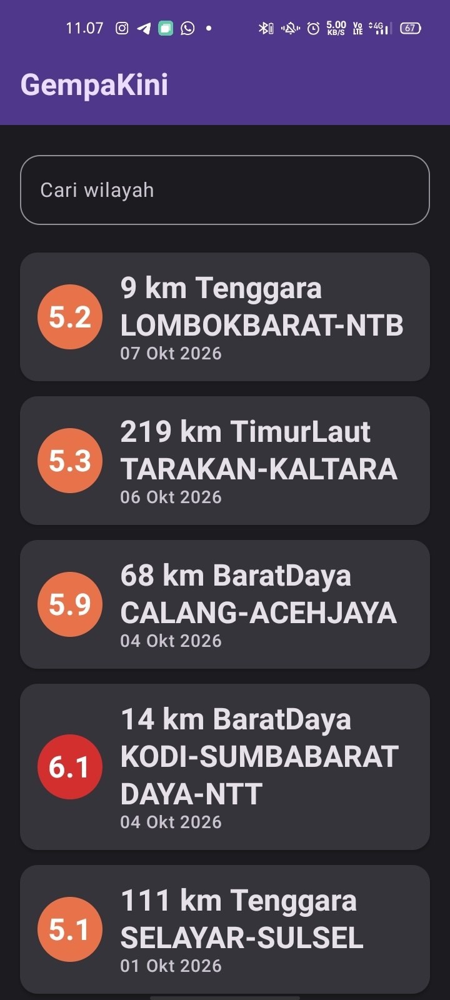
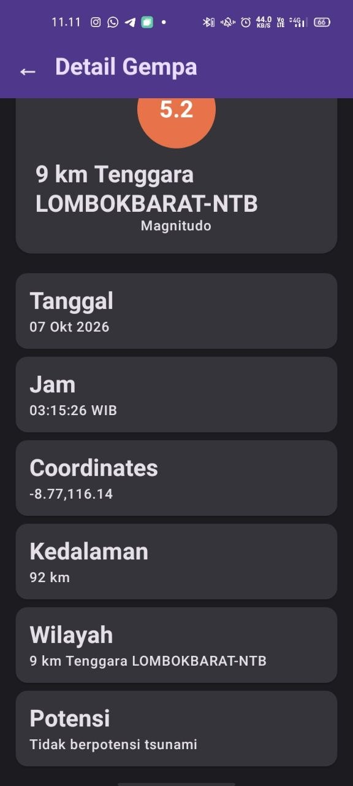

# GempaKini — Aplikasi Katalog dan Monitoring Gempa BMKG

Aplikasi mobile Android native Kotlin + Jetpack Compose untuk menampilkan data gempa real-time dari BMKG. Tugas responsi Mobile Programming semester 5.

## 📸 Screenshots

### Home Screen


- **Top bar:** Judul "GempaKini"
- **Search bar:** Filter daftar gempa berdasarkan nama wilayah (case-insensitive)
- **List:** LazyColumn gempa dengan Tanggal, Magnitudo, Wilayah — klik item masuk detail

### Detail Screen


- **Top bar:** Judul "Detail Gempa" + tombol back (←)
- **Content:** 7 field detail (Tanggal, Jam, Coordinates, Magnitudo, Kedalaman, Wilayah, Potensi)
- **Tombol back:** Kembali ke Home dan list terfilter yang sebelumnya

## ✨ Fitur

| # | Fitur | Keterangan |
|---|-------|-----------|
| 1 | Fetch data BMKG | GET endpoint `/DataMKG/TEWS/gempaterkini.json` via Retrofit, tanpa API key |
| 2 | List gempa terkini | LazyColumn menampilkan Tanggal, Magnitudo, Wilayah |
| 3 | Search filter lokal | Ketik wilayah → list terfilter instant, bukan re-fetch API |
| 4 | Loading state | CircularProgressIndicator saat fetch berjalan |
| 5 | Error state | Pesan error jika fetch gagal (no internet/API down) |
| 6 | Detail screen | Klik item → 7 field detail + tombol back |
| 7 | Reusable component | `GempaListItem` composable dipanggil di LazyColumn |
| 8 | Material Design 3 | Scaffold, TopAppBar, Card, OutlinedTextField, custom theme |
| 9 | Null safety Kotlin | Semua String non-nullable, tidak ada `!!` |
| 10 | Navigation | 2 screen via `navigation-compose`, state preserved saat back |

## 🏗️ Architecture (MVVM)

```
Composable (UI Layer)
├── HomeScreen → [Scaffold, TopAppBar, SearchBar, LazyColumn, GempaListItem]
└── DetailScreen → [Scaffold, TopAppBar, DetailRow x7]
       ↓
ViewModel (Logic Layer)
└── HomeViewModel → [StateFlow uiState, search filter, getGempaAt(index)]
       ↓
Repository (Data Access)
└── GempaRepository → [suspend getGempaList(): List<Gempa>]
       ↓
Network Layer (Remote Data)
├── BmkgApiService (Retrofit interface)
├── RetrofitInstance (singleton)
└── [OkHttp + Gson converter]
       ↓
Data Model
└── GempaResponse / Infogempa / Gempa (data class, field persis match JSON BMKG)
```

**Pattern:** State-driven UI via `StateFlow<UiState>` (sealed class: Loading/Success/Error). Tidak ada API call langsung di Composable—wajib lewat ViewModel. Search filter dilakukan lokal di ViewModel (O(n) filter), bukan network call ulang.

## 🔌 API

**Endpoint:** `GET https://data.bmkg.go.id/DataMKG/TEWS/gempaterkini.json`

**Request:** Tanpa header khusus, tanpa auth, tanpa query param.

**Response struktur:**
```json
{
  "Infogempa": {
    "gempa": [
      {
        "Tanggal": "06 Okt 2026",
        "Jam": "14:30:00 WIB",
        "DateTime": "2026-10-06T07:30:00+00:00",
        "Coordinates": "-7.50,112.30",
        "Lintang": "7.5 LS",
        "Bujur": "112.3 BT",
        "Magnitude": "4.5",
        "Kedalaman": "10 km",
        "Wilayah": "Kab. Malang",
        "Potensi": "Tidak berpotensi tsunami"
      }
    ]
  }
}
```

**Field yang dipakai:**
- `Tanggal` — ditampilkan di list + detail
- `Jam` — ditampilkan di detail
- `Coordinates` — ditampilkan di detail
- `Magnitude` — ditampilkan di list + detail
- `Kedalaman` — ditampilkan di detail
- `Wilayah` — ditampilkan di list + detail + filter search
- `Potensi` — ditampilkan di detail

## 🛠️ Tech Stack

| Layer | Teknologi | Versi | Alasan |
|-------|-----------|-------|--------|
| Bahasa | Kotlin | 2.2.10 | Wajib rubrik |
| UI | Jetpack Compose | Compose BOM 2026.02.01 | 100% Compose, Material Design 3 wajib |
| State | StateFlow | lifecycle-runtime 2.11.0 | Pola reactive, recomposition otomatis |
| Navigation | navigation-compose | 2.9.3 | Multi-screen dengan NavHost |
| ViewModel | lifecycle-viewmodel-compose | 2.11.0 | scope ke Composable level |
| Network | Retrofit | 2.11.0 | Wajib, HTTP client |
| JSON | Gson | (included retrofit) | converter-gson wajib |
| Build | Gradle 9.5.0 | - | Build tool standard Android |
| Min SDK | 24 | - | Kompatibilitas luas |
| Target SDK | 37 | - | API level terbaru di template |

**Lib yang TIDAK dipakai (sesuai rubrik batasan):**
- ~~Hilt/Koin~~ → manual singleton/viewModel()
- ~~Coil/Glide~~ → no image library
- ~~Room/DataStore~~ → no persistence (in-memory only)
- ~~OkHttp logging~~ → clean dependency

## 🎨 Customization Theme

### Color.kt
- `SeismicRed80/40` — tema gempa (alert, primary color)
- `OceanBlue80/40` — tema BMKG/laut (secondary)
- `EarthAmber80/40` — tema bumi (tertiary)
- Light & Dark ColorScheme custom di Theme.kt

### Theme.kt
- `GempaKiniTheme { }` composable wrapper
- `lightColorScheme(...)` custom pakai warna di atas
- `darkColorScheme(...)` custom, dynamicColor disabled biar scheme konsisten

### Type.kt
- Override **titleLarge**: `FontWeight.Bold`, `fontSize=24sp`, `lineHeight=30sp`
- Override **bodyMedium**: `FontWeight.Medium`, `fontSize=14sp`, `letterSpacing=0.25sp`
- Base **bodyLarge** dipertahankan default

## 📋 Poin Teknis Rubrik

✅ **Kotlin:**
- [x] `data class` untuk Gempa/GempaResponse
- [x] Null safety (String non-nullable, tidak ada `!!`)
- [x] Lambda di onClick/onQueryChange callback
- [x] Extension function tidak dipaksa (tidak ada kasus natural)

✅ **UI/Compose:**
- [x] 100% Jetpack Compose, bukan XML layout
- [x] Composable terpisah: HomeScreen, DetailScreen, GempaListItem, SearchBar, LoadingView, ErrorView
- [x] `LazyColumn` untuk list gempa
- [x] Reusable `GempaListItem` (dipanggil di LazyColumn)
- [x] Material Design 3 (`Scaffold`, `TopAppBar`, `Card`, `MaterialTheme`)
- [x] Color.kt dimodifikasi (custom palet gempa/laut/bumi)
- [x] Theme.kt custom light/dark ColorScheme
- [x] Type.kt override 2 style (titleLarge, bodyMedium)
- [x] Scaffold + TopAppBar di Home dan Detail

✅ **List & Data:**
- [x] `LazyColumn` saja
- [x] Data dari API BMKG (bukan dummy)
- [x] Minimal info per item: Tanggal, Magnitudo, Wilayah
- [x] Tidak ada image lib (Coil/Glide tidak diimport)

✅ **State & Recomposition:**
- [x] StateFlow `uiState`, bukan var biasa di Composable
- [x] Search filter lokal (bukan re-fetch)
- [x] Loading state CircularProgressIndicator
- [x] Error state Text message
- [x] UI recompose otomatis saat state berubah

✅ **Networking:**
- [x] `INTERNET` permission di AndroidManifest.xml
- [x] Retrofit + converter-gson, base URL `https://data.bmkg.go.id`
- [x] Endpoint: `/DataMKG/TEWS/gempaterkini.json`
- [x] Data minimal: Tanggal, Jam, Coordinates, Magnitude, Kedalaman, Wilayah, Potensi
- [x] Dep check: hanya retrofit, converter-gson, navigation-compose, lifecycle-viewmodel-compose (+ default Compose/Material3)

✅ **Architecture (MVVM):**
- [x] Layer terpisah: Composable / ViewModel / Repository / API Service / Model
- [x] Sealed `UiState(Loading, Success, Error)` via StateFlow
- [x] TIDAK ada API call di Composable (0 hasil grep `RetrofitInstance` di `*Screen.kt`)

✅ **Screens:**
- [x] 2 screen max via navigation-compose
- [x] Home: judul, search bar, list (Tanggal+Magnitudo+Wilayah), klik → Detail
- [x] Detail: 7 field detail + tombol back berfungsi

## 📦 Build & Run

### Build APK Debug
```bash
cd AndroidStudioProjects/GempaKini
./gradlew assembleDebug
```
APK output: `app/build/outputs/apk/debug/app-debug.apk`

### Install ke device/emulator
```bash
adb install -r app/build/outputs/apk/debug/app-debug.apk
```

### Run di Android Studio
- File → Open → pilih `AndroidStudioProjects/GempaKini`
- Build → Build Bundle(s) / APK(s) → Build APK(s)
- Run → Select Device

### Requirements
- Android SDK 24+ (minSdk di gradle)
- Internet connection (untuk fetch BMKG)

## 📝 Struktur Project

```
GempaKini/
├── app/
│   ├── src/main/
│   │   ├── java/com/example/gempakini/
│   │   │   ├── MainActivity.kt
│   │   │   ├── data/
│   │   │   │   ├── model/Gempa.kt
│   │   │   │   ├── remote/
│   │   │   │   │   ├── BmkgApiService.kt
│   │   │   │   │   └── RetrofitInstance.kt
│   │   │   │   └── repository/GempaRepository.kt
│   │   │   └── ui/
│   │   │       ├── theme/
│   │   │       │   ├── Color.kt
│   │   │       │   ├── Theme.kt
│   │   │       │   └── Type.kt
│   │   │       ├── home/
│   │   │       │   ├── HomeScreen.kt
│   │   │       │   ├── HomeViewModel.kt
│   │   │       │   └── UiState.kt
│   │   │       ├── detail/DetailScreen.kt
│   │   │       └── navigation/
│   │   │           ├── Screen.kt
│   │   │           └── NavGraph.kt
│   │   ├── AndroidManifest.xml
│   │   └── res/
│   ├── build.gradle.kts
│   └── ...
├── build.gradle.kts
├── gradle/libs.versions.toml
├── settings.gradle.kts
├── docs/
│   ├── PRD.md
│   ├── DESIGN.md
│   ├── API_SPEC.md
│   └── CHECKLIST.md
└── README.md (this file)
```

## 🚀 Deliverable Submission

1. **Repository GitHub** — [URL akan diberikan saat push]
2. **README.md** ✅ — ini file, berisi screenshot, fitur, architecture, API, poin teknis
3. **APK Debug** ✅ — ada di `app/build/outputs/apk/debug/app-debug.apk`, bisa di-share via drive/GitHub release
4. **Video Penjelasan Kode** — TBA, fokus walkthrough logic code (HomeViewModel search filter, fetch di init, StateFlow collection di Composable, navigation index), bukan demo UI pakai app
5. **Link form submission** — setelah all item siap

## 📌 Catatan Teknis

- **Fetch API:** Dilakukan di `HomeViewModel.init()` via `viewModelScope.launch { }`. Tidak ada retry otomatis, cukup manual re-fetch jika gagal (UiState.Error ditampilkan).
- **Search filter:** Dilakukan lokal di `ViewModel.onSearchQueryChange()` dengan `allGempa.filter { it.Wilayah.contains(...) }`. Kompleksitas O(n), gak hit API.
- **Navigation state:** Detail Screen menerima index integer, memanggil `viewModel.getGempaAt(index)` dari list terfilter saat itu. Back button automatic pop backstack via `navController.popBackStack()`.
- **Theme:** dynamicColor sengaja disabled (`GempaKiniTheme` pakai custom scheme, bukan dynamic), supaya palet custom konsisten di semua device/API level.
- **Icons:** Tidak pakai `Icons.Default` (itu butuh material-icons-extended, lib terpisah yang tidak di-list izin). Pakai Text symbol emoji/karakter (`←`, 🔍) sebagai ganti.

---

**Dibuat:** Oktober 2026  
**Mahasiswa:** Rifky Dwi Rahmat Prakoso (H1D024001)  
**Mata Kuliah:** Mobile Programming I — Responsi BMKG Gempa Terkini  
**Program Studi:** Informatika, UNSOED
